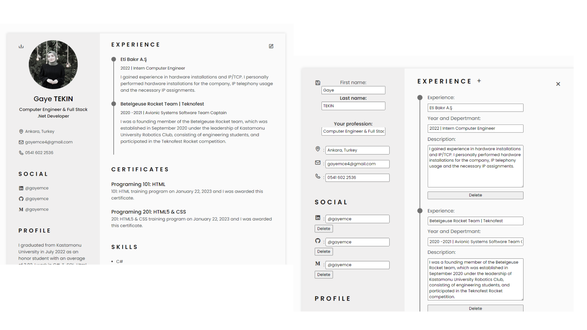

# CV Oluşturma Projesi

Bu proje, bir kullanıcının kişisel bir özgeçmişi (CV) oluşturmasına ve düzenlemesine olanak tanır. CV içeriği, kullanıcının adı-soyadı, mesleği, sosyal medya profilleri, eğitim, deneyim, sertifikalar, beceriler ve diller gibi farklı bölümlerden oluşur. Projeyi, bir istemci (client) ve bir sunucu (server) olmak üzere iki ana bileşen olarak düşünebiliriz.

## Kullanılan Teknolojiler

### Frontend Teknolojileri
- **HTML (HyperText Markup Language):** HTML, web sayfalarını yapısını tanımlayan işaretleme dilidir. Projenin kullanıcı arayüzünün temel bileşenlerini HTML ile oluşturulur.

- **CSS (Cascading Style Sheets):** CSS, web sayfalarının görünümünü düzenlemek için kullanılan bir stil dilidir. Proje, CSS ile kullanıcı arayüzünün tasarımını oluşturur.

- **JavaScript:** JavaScript, projenin istemci tarafında kullanılan bir programlama dilidir. İstemci tarafı işlevselliği, kullanıcı etkileşimleri ve veri iletişimi için JavaScript kullanır.

- **Axios:** Axios, HTTP istekleri yapmak ve sunucu ile iletişim kurmak için kullanılan bir JavaScript kitaplığıdır. Proje, Axios'u sunucuyla iletişim kurmak için kullanır.

### Backend Teknolojileri
- **Node.js:** Node.js, hızlı ve verimli bir şekilde sunucu tarafı uygulamaları geliştirmek için kullanılan bir JavaScript çalıştırma zamanıdır. Projede sunucu tarafı kodu Node.js ile yazılmıştır.

- **Express.js:** Express.js, Node.js uygulamalarını hızlı ve kolay bir şekilde oluşturmak için kullanılan bir web uygulama çerçevesidir. Proje, sunucu tarafı API'lerini oluşturmak ve yönetmek için Express.js kullanır.

- **MongoDB:** MongoDB, NoSQL tabanlı bir veritabanı sistemidir. Projede kullanıcıların verilerini depolamak ve yönetmek için MongoDB kullanılmaktadır.

- **Mongoose:** Mongoose, MongoDB ile iletişim kurmak ve MongoDB verilerini modellemek için kullanılan bir Node.js kütüphanesidir. Projede MongoDB verilerinin işlenmesi ve yönetilmesi için Mongoose kullanılır.

### Diğer Teknolojiler
- **UUID (Universally Unique Identifier):** UUID, benzersiz kimlikler oluşturmak için kullanılan bir tanımlayıcıdır. Projede öğelerin benzersiz kimliklerini oluşturmak için UUID kullanılır.

## Ekran Görüntüleri

Projenin bazı ekran görüntülerini aşağıda bulabilirsiniz:

